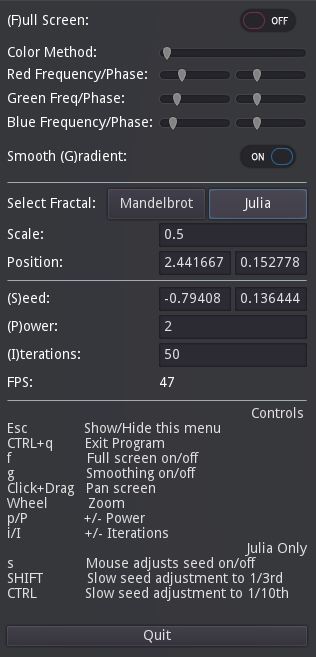

# Godot Fractal Art

This project generates the Mandelbrot and Julia fractal sets using shaders and the Godot Engine.

The latest supports Godot 4.x. See the tags for the 3.x version.

What sets this fractal generator apart from others is that you can control the Julia seed with mouse movement and watch some interesting visual effects.

## Watch A Youtube Video That Shows Even More Animations

## How To Use
All the keys are in the menu. Here are some highlights:
* Pan with click+drag, zoom with the wheel.
* On the Julia set, press 's' to change the seed with mouse control to get the cool animated effects. Hold SHIFT or CTRL to slow down the movement. Press 's' to lock the seed in place.
* Escape will show and hide the menu. The keys work when the menu is hidden.
* The fractal equation is Z[n+1] = Z[n]^2 + c. Try increasing or decreasing the Power with P for some interesting results, even going negative! The squared algorithm is optimized. All other powers are slower.
* Iterations determines how far down into the set it calculates. More iterations are slower.

## How To Colorize
### Color Method #1 - More complex, but more interesting
* This function uses sine waves for each of Red, Green and Blue. You can change the frequency, or number of cycles from the top of the fractal (the outside) to the bottom (the inside, down to the iteration count), as well as the phase, or starting position of the cycles.
* The sliders on the left dictate the frequency, or the number of times that color goes from black to full color, up to a maximum of 6. 
* The sliders on the right dictate the phase, or the starting position of the color cycle along the fractal.

* Example Walkthrough:
  1. Slide all 6 sliders to zero. 
  1. Move red frequency up slightly until the fractal goes from black to red. 
  1. Move it up further until you see 3 cycles of black to red.
  1. Increase red phase and you will see the starting point for red move up and down the fractal.
  1. Now, reset red phase back to zero.
  1. Increase blue frequency until it exactly matches red frequency. The fractal becomes exactly black to purple.
  1. Next, change the blue phase until black is virtually gone and blue and red hardly mix.
  1. Finally, slowly increase green frequency up to a small number. Then play with green phase to move green up and down.
  
By adjusting the frequency and phase of each color, you can blend them to create both interesting and ugly results. For best results, start with low frequencies, explore the full range of the phases, and make slow adjustments.

Also, you can click a slider then use your arrow keys for more control.

### Color Method #2 - Simple gradient
* This function just uses a simple two color gradient (first two colors), with an overlaid accent (third color).
* Use the sliders to adjust the position and width of the accent color from the top of the fractal down to the bottom.
* Change accent width to zero to remove it.

## Limitations
You can only zoom in to a scale of around 20,000-100,000 before you start seeing blocky results. Godot only supports single precision shaders currently. Perhaps when they support double precision, we can zoom in further. I attempted to implement emulated double precision, and while this tremendously lowered my framerate, it did not increase the resolution. The experiment can be found in materials/mandelbrot-double.shader and .material. 
